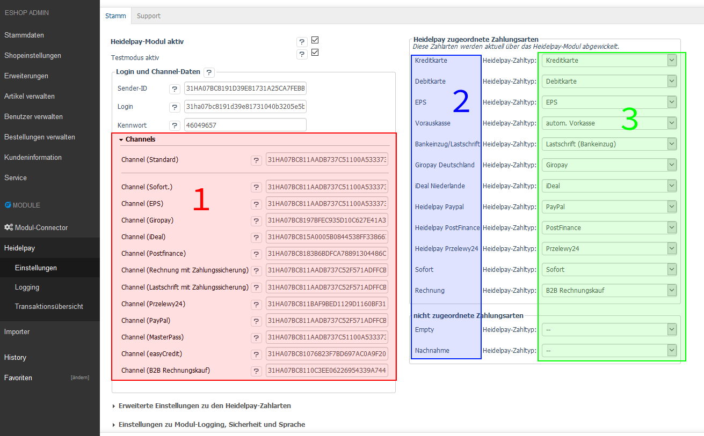
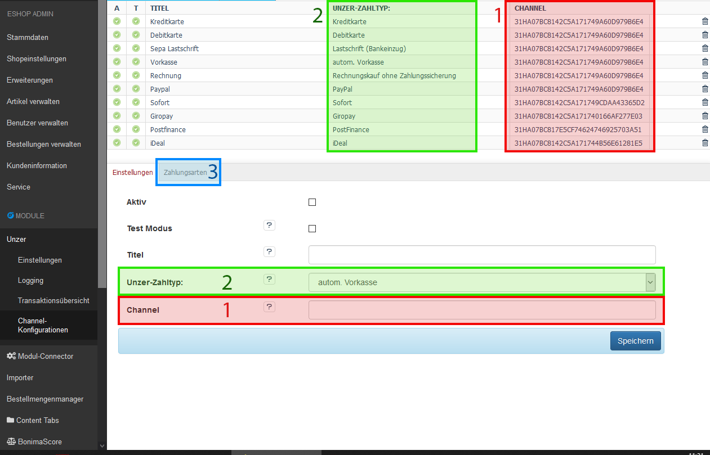
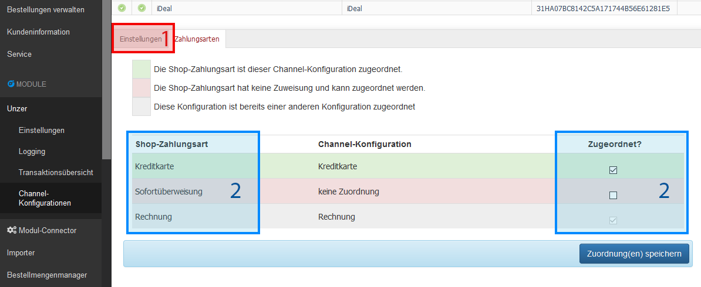

## Einleitung
Wir haben für Shopbetreiber die Admin Konfiguration überarbeitet, damit eine flexiblere Konfiguration der Zahlungsarten und Channels möglich ist.  
So sind bspw. unterschiedliche Konfigurationen für jedes einzelne Rechnungsland möglich.
## Migration der Channeldaten  
Die Migration (Umstellung) auf die neue Konfiguration wird in der automatischen Installation des Moduls vorgenommen.  
Die Update-Routine durchläuft die alten Zuordnungen und erstellt daraus neue Channel-Konfigurationen.  

> [i] Bei konfigurierten Zahlungsart-Zuordnungen ohne einen entsprechend hinterlegten Channel nicht übernommen werden.  

> [i] Es können doppelte Channel-Konfigurationen angelegt werden. Die Migration wird auf bestehende Konfigurationen der Modulversion 5.3.x.x, sowie 6.0.x.x durchgeführt.  

> [i] Die nach Abschluss der Migration neu angelegten Konfigurationen sind unbedingt manuell zu überprüfen!  

**Im Folgenden, wird anhand von Screenshots des Admin erklärt, wie die Konfiguration in der alten und im Vergleich in der neuen Konfigurationsmaske durchgeführt wird:**

## Einstellungen bis 6.0.3.x
Die Channeldaten <strong style="color:#F00; font-size: 24px;">1</strong> (bspw. 31HA07BC8142*******49A60D979B6E4) werden 
in einzelne Channel-Felder unter [D³ Module]/[Unzer]/[Einstellungen]/[Stamm]/[Channels] gepflegt.   
Ein einzelnes Channel-Feld (bspw. [Channel (Standard)]) kann **direkt** eine oder mehrere Unzer-Zahltypen (Kreditkarte, Debitkarte, autom. Vorkasse, etc) bedienen. 
Die einzelnen Oxid Zahlungsarten <strong style="color:#00F; font-size: 24px;">2</strong> werden direkt einem Unzer-Zahltyp zugewiesen <strong style="color:#0f0; font-size: 24px;">3</strong>.
<fieldset>
  <legend>bisherige Einstellungen vor 6.1.0.0</legend>
  
</fieldset>

### Channel-Konfiguration ab 6.1.0.0
Die Channeldaten <strong style="color:#F00; font-size: 24px;">1</strong> werden in [D³ Module]/[Unzer]/[Channel-Konfigurationen] in einzelnen Channel-Konfigurationen abgelegt.  
In der Channel-Konfiguration können Sie verschiedene Einstellungen nutzen:
- Aktiv - aktiv: Die Channel-Konfiguration wird genutzt
- Test Modus - aktiv: Die Channel-Konfiguration wird für den Testmodus genutzt
- Titel - dient dem Shopbetreiber als interne Beschreibung (wird derzeit in der Channel-Konfiguration's Übersicht genutzt)
- Unzer-Zahltyp <strong style="color:#0f0; font-size: 24px;">3</strong> - Hier wählen Sie die zu verwendende Zahlungstypen (bspw Kreditkarte, B2B Rechnungskauf, Paypal, usw.) für die der Channel eingerichtet ist 
- Channel <strong style="color:#F00; font-size: 24px;">1</strong> - Tragen Sie hier den Channel ein, den Sie von Unzer erhalten haben
- Zuordnung der aktuell gewählten Channel-Konfiguration, zu den Shop-Zahlungsarten <strong style="color:#00F; font-size: 24px;">2</strong>

<fieldset>
  <legend>Übersicht der Channel-Konfiguration</legend>
  
</fieldset>
<fieldset>
  <legend>Zuordnungen der Shop-Zahlungsarten zu der aktuellen Channel-Konfiguration</legend>
   
</fieldset>

> [i] Zukünftig sollen weitere Zahlungstyp-spezifische Einstellungen migriert werden.
