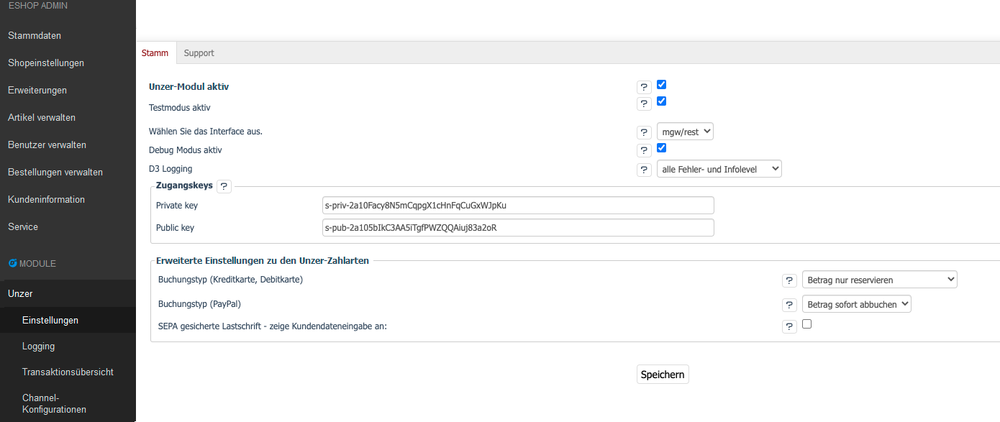

## Einleitung
Seit 10. Dezember 2018 bietet Unzer offiziell eine Rest Api (auch PaymentApi / MGW genannt) an.  
Die neue Schnittstelle unterscheidet sich erheblich zu den vorherigen Schnittstellen.  
Für die Integration in den Oxid Shop bleibt die Anbindung an die bisherige Schnittstelle Legacy Payments / NGW erhalten.

## Was ändert sich für den Shopbetreiber im Modul?
Der Administrator kann unter  [D³ Module]/[Unzer]/[Einstellungen]/[Stamm]/[Wählen Sie das Interface aus.] die entsprechende Schnittstelle (ngw = bisherige und mgw/rest = neu) auswählen.  
Die Daten SenderId, Login, Passwort und Channels werden durch Zugangskeys (Key Pair) ersetzt.  
Diese können nach der Umstellung auf "mgw/rest" in einem neuen Abschnitt [Zugangskeys] eingetragen werden.  
  

Den Zahlungsmitteln entsprechende Formulare werden im Bestellschritt "3. Versand & Zahlungsart" angezeigt.

## Welche Zahlungsarten werden unterstützt?
- Kartentypen (Kredit- und Debitkarten wurden zusammengefasst)
- SEPA ELV mit / ohne Zahlungssicherung
- Rechnungskauf B2B versichert 
- Rechnungskauf B2C versichert / unversichert 
- iDeal
- Flexipay Direct
- Paypal
- Vorkasse
- Sofort
