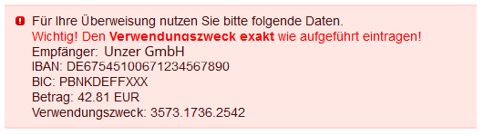

Im folgenden Abschnitt sehen Sie ein PHP Script, womit ein Entwickler an jeder beliebigen Stelle im Shop,  
die Zahlungsinformationen implementieren kann (bspw. Oxid eigenen Invoice PDF Modul oder für die Anbindung einer Warenwirtschaft):
```php
/** @var \D3\Heidelpay\Modules\Application\Model\Order $order */
$order = oxNew(\OxidEsales\Eshop\Application\Model\Order::class);
$order->load('OxidDerBestellung');

var_dump($order->getHeidelpayBankTransferData());
/* returns false or :
stdClass::__set_state(array(
    'Type' => 'd3_d3heidelpay_models_payment_invoice_unsecured',
    'Currency' => 'EUR',
    'Amount' => '33.80',
    'ShortID' => '3457.1523.6672',
    'UniqueID' => '31HA07BC81287D6A78968151B24C6A22',
    'TransactionID' => '4387__@@2016-12-15 09:00:36',
    'Bank' => '37040044',
    'Number' => '5320130',
    'Holder' => 'Unzer (GmbH)',
    'Iban' => 'DE89370400440532013000',
    'Bic' => 'COBADEFFXXX',
    'Country' => 'DE',
    'Reference' => '3457.1523.6672',
))*/
```  

Ein Anwendungsbeispiel wird dem Kunden bereits auf der "Thank You" Seite angezeigt:  

