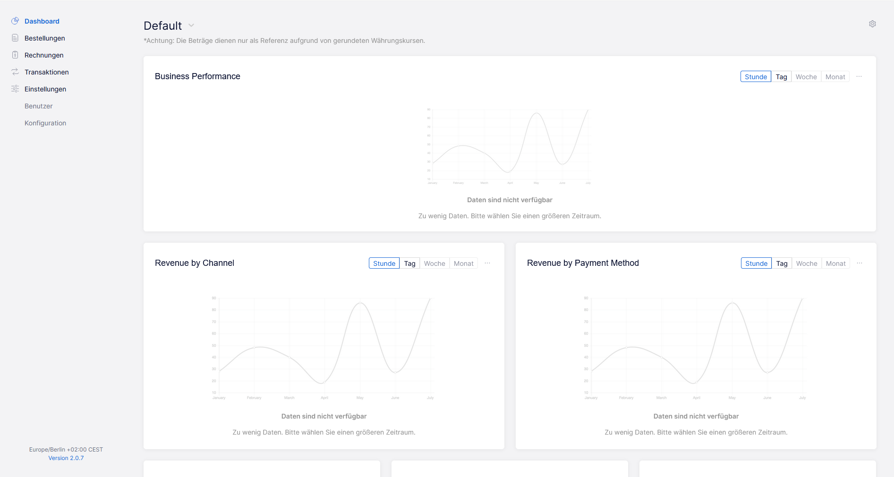

Um diese Schnittstelle nutzen zu können, benötigen Sie Zugangsdaten zum Unzer Insights. Fordern Sie diese für den Live- und Testmodus beim Unzer-Support über das [Formular](https://www.unzer.com/de/kontakt-vertrieb/) oder per E-Mail `support@unzer.com` an.

Melden Sie sich bitte mit den Zugangsdaten an:

- [ Insights für Live-Modus ](https://insights.unzer.com/)
- [ Insights für Test-Modus ](https://sbx-insights.unzer.com/)

Darin werden Sie weitere Informationen finden, die Sie für die vollständige Konfiguration benötigen.

