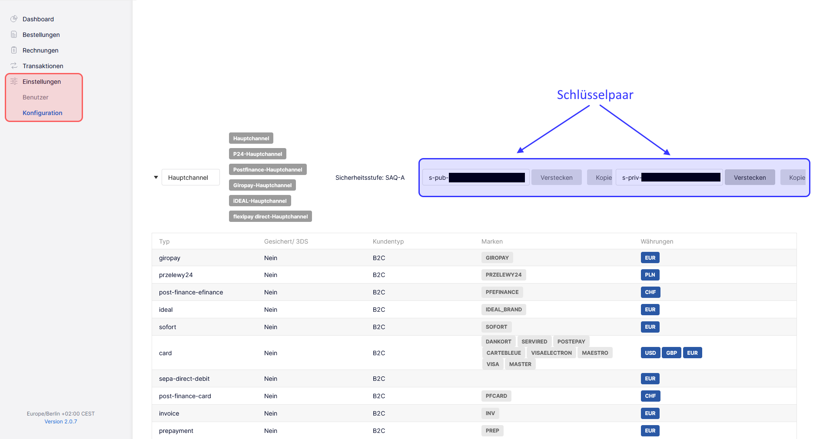

Mit der PaymentApi / MGW-Schnittstelle haben Sie spielend leicht die Möglichkeit, zwischen Test- und Liveumgebung zu wechseln. Dafür benötigen Sie nichts weiter, als die im Unzer Insights findbaren Schlüsselpaare.

Navigieren Sie dafür in der linken Sidebar, unter [ Einstellungen ] > [ Konfiguration ] auf die Schlüsselübersicht.

Wählen Sie den [ Hauptchannel ] (der generelle Eintrag kann kontoabhängig auch anders benannt sein), um Zugang zu den benötigten Schlüsselpaaren zu bekommen. Bitte notieren Sie beide Schlüssel, da beide im nächsten Schritt benötigt werden.

