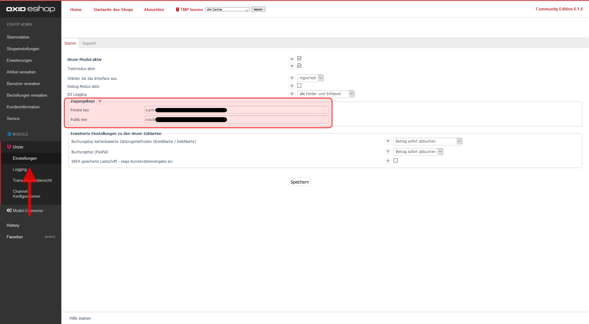

Wechseln Sie jetzt bitte in Ihren Shop-Admin unter [ D3 Module ] -> [ Unzer ] -> [ Einstellungen ].

Wählen Sie beim [ Interface ] die PaymentApi / MGW-Schnittstelle und speichern diese Einstellung bitte ab.

Tragen Sie nun die Schlüssel des Live- bzw. Testmodus in die entsprechenden Felder ein:

Ihnen stehen vier verschiedene Schlüssel zur Verfügung stehen:

- `s-priv-...`: privater Schlüssel (Private Key) für den Testmodus
- `s-pub-...`: öffentlicher Schlüssel (Public Key) für den Testmodus
- `p-priv-...`: privater Schlüssel (Private Key) für den Livemodus
- `p-pub-...`: öffentlicher Schlüssel (Public Key) für den Livemodus

Tragen Sie die beiden Schlüssel des Live- bzw. Testmodus in die entsprechenden Felder ein.

