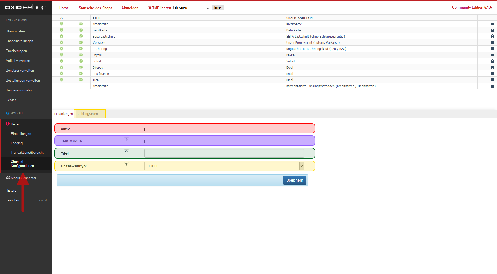

Navigieren Sie in die Unzer Channel Konfiguration im Shopadmin unter [ D3 Module ] -> [ Unzer ] -> [ Channel-Konfigurationen ]. Im Tab [ Einstellungen ] setzen Sie die grundlegenden Channeleinstellungen.

Im oberen Bereich sehen Sie Channelprofile. Ungenutzte Profile können Sie löschen, fehlende Profile erstellen Sie sich bitte neu.

Wählen Sie nun das einzurichtende Profil. 

In der unteren Bildschirmhälfte sehen Sie die Einstellungen des Channels, die Sie wie folgt bearbeiten können:

| Name          | Aufgabe                                                                                                                                                       |
|---------------|:--------------------------------------------------------------------------------------------------------------------------------------------------------------|
| Aktiv         | Bitte setzen Sie den Haken, um diesen Channel zu verwenden.                                                                                                   |
| Test Modus    | Wenn Sie den Haken setzen, dann verwendet das Modul diesen Channel im Test-Modus. Für den Live-Modus legen Sie sich eine Kopie **ohne** diesen Haken an.      |
| Titel         | Hier können Sie einen freien Namen für den Channel eintragen. Dieser dient Ihnen nur zur internen Unterscheidung.                                             |
| Unzer-Zahltyp | Hier definieren Sie, wie Unzer die Zahlung verarbeiten soll. Es werden Ihnen nur die Typen vorgeschlagen, die die PaymentApi / MGW-Schnittstelle unterstützt. |

Speichern Sie die geänderten Einstellungen ab.