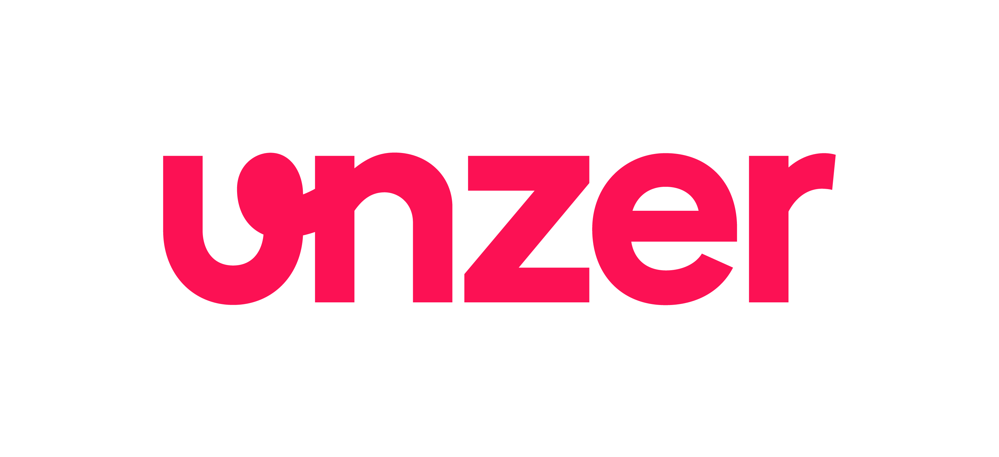

Die Unzer GmbH ist einer der innovativsten und am stärksten wachsenden Fintech-Dienstleister mit Hauptsitz in Heidelberg. Der international tätige Spezialist für Zahlungsabwicklung setzt dabei auf eigene Lösungen wie Rechnungs- und Ratenkauf, Lastschrift, Online-Überweisung, Vorkasse und Kreditkarte sowie auf Anbieter von Wallet-Lösungen. Mit über 16 Jahren Erfahrung im E-Commerce und am Point of Sale bietet die Unzer GmbH als von der BaFin zugelassenes Zahlungsinstitut Unternehmen jeder Größe die Möglichkeit, weltweite Zahlungsabwicklungen durchzuführen.

## Transaktionsübersicht an den Bestellungen 
Das Modul verfügt über einen eigenen Administrationsbereich an den Bestellungen, wo Sie mit der Premium-Version Buchungen, Stornierungen, Gutschriften etc. durchführen können.  
Eine separate Anmeldung am Unzer-Händlerbereich ist für die Zahlungsabwicklungen der Shopbestellungen dadurch nicht nötig.

## PCI 3 Konformität
PCI DSS Level SAQ-A wird ab Modulversion 5.2.0.0 (azure) unterstützt.  
Details zu PCI finden Sie unter https://www.pcisecuritystandards.org/ .

## Folgende Leistungen bietet Ihnen das Modul über das Zahlungssystem der Unzer GmbH
- Kreditkarte
- Debitkarte
- Unzer Direct Debit (SEPA Lastschrift mit Zahlungsgarantie)
- Unzer Invoice (Rechnungskauf B2C oder B2B, mit oder ohne Zahlungssicherung)
- PayPal
- Sofort Überweisung
- Giropay *
- SEPA Lastschrift
- automatische Vorkasse
- iDeal *
- EPS *
- Przelewy 24 *
- MasterPass *
- EasyCredit *
- PostFinance *
- BillSAFE (nur Bestandskunden)

> [!] Verfügbarkeit abhängig von der verwendeten Unzer-Schnittstelle und Modul-Edition

## Hinweis zu 3D Secure
"Verified by Visa" und "MasterCard Secure Code" sind Authentifizierungssysteme auf Basis der Visa-Technologie "3D Secure".  
Der Karteninhaber gibt im Web seine Kreditkartennummer ein.  
Nimmt der Issuer (kartenausstellende Bank) am 3D Secure-Verfahren teil, kann der Kartenbesitzer ein zusätzlich hinterlegtes Passwort eingeben.  
Damit erhält das Zahlungssystem des Händlers ein Authentifizierungsmerkmal.  
Die Möglichkeit zu 3D Secure ist in diesem Modul enthalten und kann bei Unzer angefragt werden.
